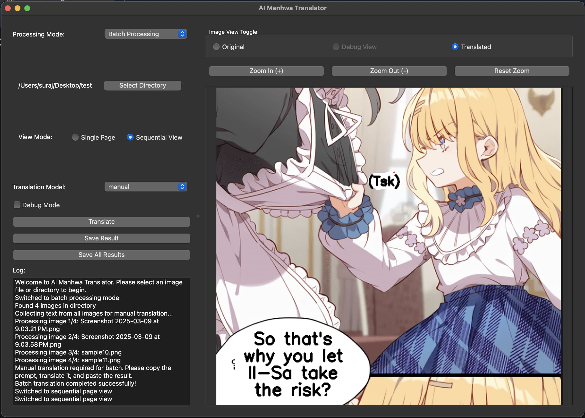

# AI Manhwa Translator
## Overview

AI Manhwa Translator is an application that leverages machine learning and AI to automatically detect, extract, and translate text from manhwa (Korean comics) images. The tool streamlines the translation process for both individual images and batch operations.

## Features

- **Text Detection**: Custom-trained YOLOv11 model detects text regions in manhwa images
- **Text Extraction**: EasyOCR extracts text from the detected regions
- **High-Quality Translation**: Integration with advanced LLMs (GPT, Gemini) for context-aware translations
- **Natural Dialogue Translation**: Specialized handling for dialogue to maintain tone and context
- **User-Friendly Interface**: PyQt-based GUI for easy operation
- **Processing Options**: Support for both single image and batch processing

## How It Works

1. **Text Detection**: The YOLO model identifies and localizes text bubbles/regions in the manhwa image
2. **OCR Processing**: EasyOCR reads the text content from the detected regions
3. **Translation Processing**: LLMs translate the text while maintaining dialogue context and tone
4. **Output Generation**: Translated text is overlaid on the original image or provided as text output

## Installation

```bash
git clone https://github.com/yourusername/AI-Manhwa-Translator.git
cd AI-Manhwa-Translator
```
If you have uv as package manager
```bash
uv sync
```
else use pip
```bash
pip install -r requirements.txt
```

## Usage

### GUI Mode

```bash
python app.py
```
## Technical Details

- **Text Detection**: Custom YOLO v11 model trained on manhwa text bubbles dataset
- **OCR Engine**: EasyOCR optimized for Korean, Japanese, and Chinese characters
- **Translation Models**: Configurable to use either OpenAI GPT or Google Gemini APIs
- **GUI Framework**: PyQt for cross-platform compatibility

# Image Previews
## Processing Interface

*Batch processing interface for translating multiple manhwa pages*

## Debug & Testing Mode

*Debug visualization showing text region detection and extraction*

## Manual Translation

*Interface for manually editing and fine-tuning translations*

## Translation Demo

*Example of original Korean text and resulting English translation*

## Requirements

- Python 3.8+
- PyTorch
- EasyOCR
- PyQt5
- OpenAI API key (for GPT)
- Google API key (for Gemini)

## Future Improvements

- Expanding language support
- Improving text region detection accuracy
- Adding font style matching
- Real-time translation options